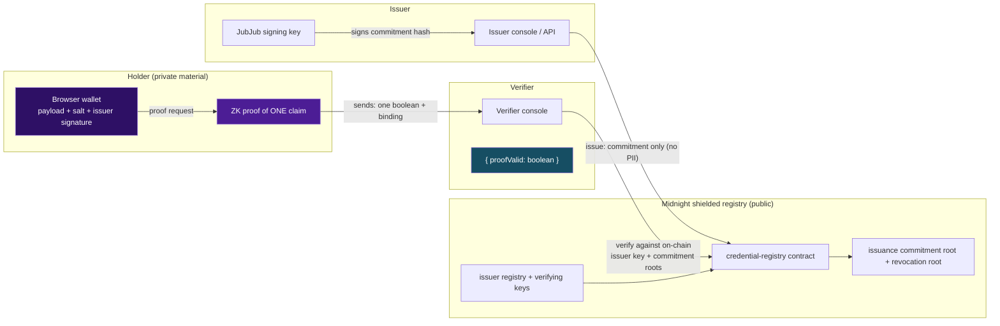

# VeriShield

[](https://github.com/pratikshakalbhor/verishield/actions/workflows/ci.yml)

Zero-knowledge credential verification on Midnight — prove a single claim, don't hand over the whole certificate.

## Live demo

> **PENDING — no public URL yet.** The frontend is ready to deploy: from the repo root run `vercel` once (auth at https://vercel.com), then `vercel --prod` — SPA/static, no backend needed (`vercel.json` is committed). This box is filled in the moment the deployment is live. Until then, run it locally with `pnpm dev` → http://localhost:3000.

## Deployed contract (Preprod)

> **PENDING — not deployed on-chain yet.**
> Today every credential (issuance, proof, verification, revocation) runs on the **circuit-simulator engine** against an in-memory ledger — nothing is broadcast to Midnight Preprod. `pnpm deploy` writes a manifest with `engine: "circuit-simulator"` and an off-chain derived address (see [Known Simulations](#known-simulations)). A real Preprod deployment needs a funded Midnight wallet and the wallet/tx integration, tracked in the Phase 5 checklist below.

| Item | Value |
|------|-------|
| Network | `preprod` |
| Contract address | `TBD` |
| Explorer | [Midnight Preprod explorer](https://explorer.midnight.network/) (address-linked once deployed) |

## Project Vision

Employers, banks and universities share entire certificates and IDs to prove one fact. That leaks name, marks, DOB and licence numbers to parties who never needed them. VeriShield anchors a *commitment* to a credential on a Midnight shielded ledger, lets the holder compute a zero-knowledge proof of a **single claim**, and hands the verifier only `{ proofValid: true }`. Midnight's data-shielded running model is core to the design: no private field ever lands on-chain in clear, and the issuer's authenticity is enforced inside the circuit, not by a trusting backend.

## Key Features

- **In-circuit issuer authenticity** — each claim circuit verifies the issuer's JubJub Schnorr signature on the credential commitment (`jubjubSchnorrVerify`) before asserting; forged or wrong-key signatures fail the proof.
- **Five claim predicates** — `HAS_CREDENTIAL`, `FIELD_EQUALS`, `RANGE_PROOF` (CGPA), `AGE_OVER`, `NOT_EXPIRED`; every circuit returns a single public `Boolean`.
- **Holder privacy** — private payload, salt and signature never leave the browser; the verifier receives exactly one boolean.
- **Revocation** — the issuer can revoke a credential and every later proof fails in-circuit (asserts `Credential has been revoked`).
- **Four-function SDK** — `buildCredential / hashCredential / generateProof / verifyProof`, plus `createVeriShield()` with registration, issuance and revocation; browser-safe entry point separates the WASM runtime.
- **Three portals** — Issuer console, Holder wallet, Verifier console wired to a shared proof store.
- **Midnight wallet connect** — 1AM DApp-Connector discovery (CAIP-372), connection status, addresses and DUST/NIGHT balances.
- **Issuer API** (service layer) — Express + SQLite, JWT auth + RBAC, credential schemas, delivery codes, audit log, OpenAPI docs.

## Architecture



Everything under **Holder (private material)** stays in the browser. The contract stores commitments and verifying keys (public), and the only value a verifier ever sees is `proofValid`.

## Tech Stack

- **Frontend:** React 18, Vite 6, TypeScript, Tailwind CSS, Zustand, Framer Motion, React Router, `vite-plugin-wasm`
- **Contract & ZK:** Compact 0.34.0, `@midnight-ntwrk/compact-runtime` 0.19.0, in-circuit JubJub Schnorr signature verification
- **Shared crypto SDK:** `@verishield/shared` — browser-safe entry + lazy WASM `sdk` subpath
- **Issuer service:** Node 22, Express, Drizzle ORM, SQLite, JWT/RBAC
- **Tooling:** pnpm 12 workspace, Vitest, ESLint, GitHub Actions

## Local Development

Works on a clean machine with no Midnight toolchain and no Docker for the core path — the compiled circuits are committed and the tests run them through the simulator. Node.js **22+** and `pnpm` are required.

```bash
# 1. Install pnpm 12 (once)
npm i -g pnpm@12.4.2

# 2. Install dependencies
pnpm install

# 3. Run the web app (all three portals, circuit-simulator engine)
pnpm dev                 # → http://localhost:3000

# 4. Full credential lifecycle against the compiled circuits (no devnet/network needed)
pnpm test:e2e-crypto     # expects 29/29 checks, in-circuit signatures + revocation

# 5. Typecheck + production build
pnpm typecheck
pnpm build
```

Optional — local Midnight devnet (node + indexer + proof server):

```bash
docker compose up -d
pnpm deploy --network=local    # writes managed/deploy/local.json (simulator manifest)
```

Optional — recompile the Compact contract (needs the Compact toolchain):

```bash
compact update 0.34.0
pnpm compile:contracts
```

Interactive walkthrough: open **Issuer** → "Issue credential", then **Holder** → "Generate proof", then **Verifier** → "Verify" — the full issue → hold → prove → verify → revoke loop runs in-browser.

## Known Simulations

This project is honest about where it is and isn't production-real:

- **Web demo = circuit simulator, not a proof server.** The three-portal web app drives the real *compiled* Compact circuits through `@midnight-ntwrk/compact-runtime`'s simulator. The in-browser ledger is in-memory and per-page. Proofs are real circuit transcripts (`engine: "circuit-simulator"`, `zkProven: false`) — the UI prints this amber warning itself. A proof server (the `docker compose` `proof-server` service) is required to turn these into real SNARKs; the SDK reserves a `proofServerUrl` option for it but it is not wired for proving end-to-end yet.
- **No on-chain deployment yet.** `pnpm deploy` registers the issuer/schema through the simulator and writes a **deterministically derived off-chain** "contract address" (from the network + wallet seed, see `src/network.ts`); it does not broadcast a transaction. There is no real Preprod contract address to paste in the README until the wallet/tx integration lands.
- **Wallet connect is real; anchoring is not wallet-backed.** The 1AM DApp-Connector integration reports real connection status, addresses and DUST/NIGHT balances, but issuance/revocation still happen in the simulator ledger rather than through the connected wallet.
- **Issuer API is a separate service.** Express + SQLite (JWT/RBAC, audit, schemas, delivery) is complete and tested on its own but is not the source of proofs in the current web demo.
- **Circuits & crypto are real.** `hashCredential` / `buildCredential` / commitments / in-circuit JubJub Schnorr verification / revocation sets are exercised by `pnpm test:e2e-crypto` (29 checks) with real compiled `.zkir` circuits.

## Phase 5 checklist (submission readiness)

| Item | Status |
|------|--------|
| MVP live on Preprod (verifiable address) | **Blocked** — needs a funded Midnight Preprod wallet + wallet/tx integration |
| Frontend deployed publicly | Ready in repo (`vercel.json`); run once — see [Live demo](#live-demo) |
| README with setup + usage | Done (this file) |
| CI/CD passing on repo | Done — [workflow](https://github.com/pratikshakalbhor/verishield/actions/workflows/ci.yml) green on `main` |
| X profile linked in README | **Needs your X URL** |
| 15+ meaningful commits | Done — 24 commits on `main` |
| Demo video recorded | **Needs recording** (script in [`doc/demo-script.md`](doc/demo-script.md)) |

## License

Apache-2.0