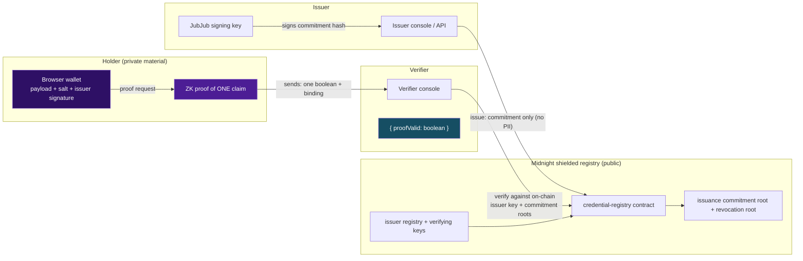

# VeriShield

Zero-knowledge credential verification on Midnight — prove a single claim, don't hand over the whole certificate.

[](https://github.com/pratikshakalbhor/verishield/actions/workflows/ci.yml)


## Table of contents

- [Live demo](#live-demo)
- [Deployed contract](#deployed-contract)
- [The problem](#the-problem)
- [Architecture](#architecture)
- [Features](#features)
- [Tech stack](#tech-stack)
- [Getting started](#getting-started)
- [Usage walkthrough](#usage-walkthrough)
- [Known simulations](#known-simulations)
- [Project structure](#project-structure)
- [Submission readiness](#submission-readiness)
- [License](#license)

---

## Live demo

> **PENDING — no public URL yet.** The frontend is build-ready: from the repo root run `vercel` once (authenticate at https://vercel.com), then `vercel --prod`. It is a static SPA — no backend to host (`vercel.json` is committed and the Vite build emits `packages/web/dist`). This box will be filled in the moment a deployment is live. Until then, run it locally:

```bash
pnpm dev   # → http://localhost:3000
```

## Deployed contract

There are **two distinct addresses — never conflated**:

| Address | Value | Status |
|---------|-------|--------|
| **Preprod** (public network) | `TBD` | **Blocked** — network fork-timing mismatch, see below |
| **Local ledger-v9 devnet** | `b72da755eea42269a7d21853c42e2c3b630f78fec8d3712d93b4a4bb66e08499` (last value in [`managed/deploy/local.json`](managed/deploy/local.json)) | Real — contract deployed on-chain by `pnpm run deploy --network=local` |

| Item | Value |
|------|-------|
| Network | `preprod` |
| Contract address | `TBD` (blocked, see below) |
| Explorer | [Midnight network explorer](https://explorer.midnight.network/) (address-linked once deployed) |

> **Preprod — BLOCKED by a network-level fork-timing mismatch.** Preprod is still on the
> pre-fork ledger **v8** (`specVersion 1000000`), while the compiled contract targets
> **ledger v9**. The v9 hard fork was staged on 2026-08-21 but has not been activated; no
> activation date/block has been announced. This is outside this project's control. The
> deploy path itself is fully real and working (see [Known simulations](#known-simulations))
> and will deploy to Preprod the moment the fork lands, provided the wallet is funded
> (https://faucet.preprod.midnight.network). Nothing has been broadcast to Preprod; the row
> above stays `TBD` until a real preprod transaction exists.
>
> **Last re-checked externally: 2026-09-21.** Independent web checks made the same day
> corroborate this status: (1) a midnightntwrk/midnight-js PR notes the hard-fork CI lane
> has been `0/7` on every branch since 2026-09-11; (2) a third-party integration repo
> (nmkr-midnight-api) states ledger **v8 (8.1.x)** is correct for preprod's current
> `event[v9]` format and that ledger-v9 releases target a *future* format preprod cannot
> parse; (3) `@midnight-ntwrk/ledger-v9` still ships release candidates (rc.5 as of
> 2026-09-14) with no stable/activated release and no announced Preprod activation date.
> This could change at any time — if there is a gap before final submission, re-verify
> before relying on the `TBD`.

## The problem

Employers, banks and universities demand the *whole certificate* to check **one fact** — a
degree, an age, a license status. That hands over name, marks, date of birth and license
numbers to parties who never needed them, and there is no cryptographic guarantee the
document shown wasn't altered. VeriShield inverts this: the issuer anchors a *commitment*
to a credential on Midnight, the holder computes a zero-knowledge proof of a **single
claim**, and the verifier receives exactly one field: `{ proofValid: boolean }`.

## Architecture



Everything under **Holder (private material)** stays in the browser. The contract stores
commitments, verifying keys and accumulator roots (all public), and the only value a
verifier ever observes is `proofValid`.

**Why issuer authenticity is enforced in-circuit.** VeriShield does not trust a backend to
tell a verifier "this credential is real". Instead, every claim circuit re-derives the
credential commitment from the holder's private payload, looks up the issuer's registered
JubJub verifying key on-chain, and calls `jubjubSchnorrVerify` *inside the circuit* against
the issuer's signature over that commitment
([`credential-registry.compact:168-187`](packages/contracts/src/credential-registry.compact#L168-L187)).
A forged or wrong-key signature fails the assertion `"Credential signature is not from the
registered issuer"` and the proof never verifies — regardless of what any off-chain
software claims. The issuer never needs to be online, and the holder proves endorsement
without revealing either the payload or the signed message to anyone. This is what the
[`pnpm test:e2e-crypto`](#usage-walkthrough) harness exercises explicitly for forged and
impostor signatures.

## Features

### In-circuit issuer authenticity

- **What it does:** every claim circuit verifies the issuer's JubJub Schnorr signature over the recomputed credential commitment against the on-chain registered verifying key before asserting (`jubjubSchnorrVerify`).
- **Why it matters:** forgery and wrong-key impostor credentials fail the proof itself; no backend, oracle or trusted third party is involved.
- **Code:** [`credential-registry.compact:181-184`](packages/contracts/src/credential-registry.compact#L181-L184) (in-circuit verify), [`credential.ts:161-165`](packages/shared/src/midnight/credential.ts#L161-L165) (issuer signing).

### Five claim predicates

- **What it does:** `HAS_CREDENTIAL`, `FIELD_EQUALS` (degree), `RANGE_PROOF` (CGPA), `AGE_OVER`, `NOT_EXPIRED` — each circuit returns a single public `Boolean`.
- **Why it matters:** one credential, five provable facts; the holder picks the minimal claim a verifier actually needs.
- **Code:** [`credential-registry.compact:268-300`](packages/contracts/src/credential-registry.compact#L268-L300) (circuits), [`proof.ts:24-30`](packages/shared/src/midnight/proof.ts#L24-L30) (SDK claim→circuit map).

### Holder privacy

- **What it does:** the private payload, salt and issuer signature never leave the browser; `generateProof` emits an artifact carrying a single boolean plus a binding digest.
- **Why it matters:** a verifier learns one fact and nothing else — the harness checks `{"proofValid":true}` is the *entire* output.
- **Code:** [`proof.ts:86-127`](packages/shared/src/midnight/proof.ts#L86-L127), [`demo.ts:101-103`](packages/web/src/lib/midnight/demo.ts#L101-L103) (module-scoped private registry).

### Revocation

- **What it does:** the issuer removes a credential into the on-chain `revokedCredentials` set; every later proof fails in-circuit with `"Credential has been revoked"`.
- **Why it matters:** revocation is enforced at proof time, globally, with no verifier-side state or revocation list to maintain.
- **Code:** [`credential-registry.compact:238-242`](packages/contracts/src/credential-registry.compact#L238-L242), [`credential-registry.compact:179`](packages/contracts/src/credential-registry.compact#L179) (in-circuit assert).

### Four-function SDK

- **What it does:** `buildCredential / hashCredential / generateProof / verifyProof` plus `createVeriShield()` with registration, issuance and revocation.
- **Why it matters:** one browser-safe surface for every consumer; the WASM runtime is isolated behind the `@verishield/shared/sdk` subpath so the web shell stays runtime-free.
- **Code:** [`midnight/index.ts:177-181`](packages/shared/src/midnight/index.ts#L177-L181), [`shared/package.json`](packages/shared/package.json) (subpath exports), [`web/src/lib/midnight/sdk.ts`](packages/web/src/lib/midnight/sdk.ts) (lazy WASM loader).

### Three portals

- **What it does:** a shared proof store drives the React routes for Issuer, Holder and Verifier consoles.
- **Why it matters:** the full issue → hold → prove → verify → revoke loop runs in one browser session, end to end.
- **Code:** [`web/src/stores/proofStore.ts:34-91`](packages/web/src/stores/proofStore.ts#L34-L91), portals in [`web/src/features/`](packages/web/src/features/).

### Wallet connect

- **What it does:** 1AM DApp-Connector discovery (CAIP-372) that enumerates injected wallet instances, reports connection status, shielded addresses and DUST/NIGHT balances.
- **Why it matters:** real Midnight wallet integration with correct protocol-level enumeration rather than a hard-coded extension key.
- **Code:** [`wallet.ts:83-104`](packages/web/src/lib/midnight/wallet.ts#L83-L104).

### Issuer API

- **What it does:** Express + SQLite service with JWT/RBAC, credential schemas, delivery codes/QR, audit log and a hand-written OpenAPI document served at `/docs`.
- **Why it matters:** a university can issue at scale (incl. CSV bulk import) while the signing/anchoring path stays behind the same cryptographic SDK.
- **Code:** [`app.ts:27`](packages/issuer-api/src/app.ts#L27) (Swagger mount), [`openapi.ts:35`](packages/issuer-api/src/openapi.ts#L35) (document).

## Tech stack

Versions below are pinned exactly as they appear in the repo's `package.json` files and in
the committed compiler manifest (`packages/contracts/managed/credential-registry/compiler/contract-manifest.json`).

| Layer | Technology | Version (as pinned) |
|-------|-----------|---------------------|
| Contract & ZK | Compact compiler / language / runtime | `0.34.0` / `0.26.0` / `0.19.0` (committed artifact manifest) |
| Contract & ZK | In-circuit verification | JubJub Schnorr (`jubjubSchnorrVerify`, `compact-runtime 0.19.0`) |
| Frontend | React / React DOM | `^18.3.0` |
| Frontend | Vite (with `vite-plugin-wasm` `^3.6.0`) | `^6.0.0` |
| Frontend | TypeScript | `^5.7.0` |
| Frontend | Tailwind CSS | `^3.4.0` |
| Frontend | Zustand / Framer Motion / React Router | `^5.0.0` / `^11.11.0` / `^6.28.0` |
| Crypto SDK | `@verishield/shared` | browser-safe entry + lazy WASM `sdk` subpath |
| Issuer service | Node / Express | `>=22` / `^4.21.0` |
| Issuer service | Drizzle ORM + `better-sqlite3` | `^0.36.0` / `^11.0.0` |
| Issuer service | Auth | JWT (`jsonwebtoken` `^9.0.2`) + RBAC, `express-rate-limit` `^7.4.0` |
| Deploy toolchain | `@midnight-ntwrk/compact-js` / `compact-runtime` | `2.5.5-rc.8` / `0.19.0` |
| Deploy toolchain | `midnight-js-contracts` / `testkit-js` | `5.0.0-beta.8` |
| Tooling | pnpm | `12.4.2` (`packageManager`, CI pin) |
| Tooling | Vitest / ESLint | `^3.2.0` / `^10` + `typescript-eslint` |
| CI | GitHub Actions | [`.github/workflows/ci.yml`](.github/workflows/ci.yml) — lint · typecheck · build · e2e-crypto |

## Getting started

Works on a clean machine with **no Midnight toolchain and no Docker** for the core path:
the compiled circuits are committed, and the tests drive them through
`@midnight-ntwrk/compact-runtime`'s simulator. Node.js **22+** and `pnpm` are required.

```bash
# 1. Install pnpm 12 (once)
npm i -g pnpm@12.4.2

# 2. Install dependencies
pnpm install

# 3. Run the web app (three portals, circuit-simulator engine)
pnpm dev                      # → http://localhost:3000

# 4. Full credential lifecycle against the compiled circuits (no devnet/network needed)
pnpm test:e2e-crypto          # expects 29/29 checks — in-circuit signatures + revocation

# 5. Lint, typecheck, production build
pnpm lint
pnpm typecheck
pnpm build
```

*Freshly re-verified on this box (2026-09-21): `pnpm install`, `pnpm test:e2e-crypto`
(29/29 passed), `pnpm lint`, `pnpm typecheck` and `pnpm build` all succeed — Node
`v22.22.1`, pnpm `12.4.2`.*

Optional — current-era local Midnight devnet (node `2.1.0-beta.1` + indexer
`4.4.0-rc.2` + proof server `9.0.0-rc.7`):

```bash
docker compose up -d
pnpm run deploy --network=local    # writes managed/deploy/local.json (REAL deploy tx, ledger v9)
```

Optional — recompile the Compact contract (needs the Compact `0.34.0` toolchain):

```bash
compact update 0.34.0
pnpm compile:contracts
```

## Usage walkthrough

The complete flow, matching the ordered output of `pnpm test:e2e-crypto`:

1. **Issuer registers** a JubJub Schnorr key pair — the verifying key is stored on-chain and every later proof is checked against it.
2. **Issuer anchors a credential** — the holder's credential is hashed into a commitment (nothing else is revealed) and the issuer signs the commitment.
3. **Holder generates a proof** for *one* claim type (`HAS_CREDENTIAL`, `FIELD_EQUALS`, `RANGE_PROOF`, `AGE_OVER`, `NOT_EXPIRED`) against the private payload.
4. **Verifier sees ONLY `{ proofValid: true }`** — the harness asserts the public output is exactly `{"proofValid":true}` and that false, forged or tampered claims are rejected.
5. **Issuer revokes the credential** — the next proof attempt fails in-circuit: `failed assert: Credential has been revoked`.

```text
3. Positive proofs — every claim must verify
  ✓ HAS_CREDENTIAL  proven & verified   25.625ms
  ✓ FIELD_EQUALS    proven & verified   21.78ms
  ✓ RANGE_PROOF     proven & verified   16.984ms
  ...
5. In-circuit issuer-signature enforcement
  ✓ forged signature rejected in-circuit  failed assert: Credential signature is not from the registered issuer
  ✓ signature from a non-issuer key rejected in-circuit
6. Revocation
  ✓ revoked credential can no longer be proven  failed assert: Credential has been revoked

29/29 checks passed — all good
```

In the browser (`pnpm dev`): the **Issuer** portal issues, the **Holder** portal generates
a proof, the **Verifier** portal reveals `{ proofValid: true }` alongside a redacted
"Not transmitted" panel — and revocation disables further proofs on that credential.

## Known simulations

This project is honest about where it is and isn't production-real. Every claim below was
re-verified against the current repo state and the evidence files in
[`doc/evidence/`](doc/evidence/) on 2026-09-21.

- **Contract deploy: REAL.** `pnpm run deploy --network=local` deploys the credential
  registry to a **local ledger-v9 devnet** — a real node
  (`midnightntwrk/midnight-node:2.1.0-beta.1`, `specVersion 2001000`), a real proof server
  (`midnightntwrk/proof-server:9.0.0-rc.7`), real wallet/fee balancing, and a real deploy
  transaction accepted and applied by the node. Evidence (from the reproducibility
  validation run, [`doc/evidence/evidence-deploy.json`](doc/evidence/evidence-deploy.json)):
  the submission was applied as extrinsic
  `576f8749e906dd53750a961e81cc73b91698e691d234d5aea6ed6a787cfc777a`, included in
  **block #5** (`0x6d51c3d8…43a900`); contract
  `b72da755eea42269a7d21853c42e2c3b630f78fec8d3712d93b4a4bb66e08499` (SDK tx id
  `00f94fa6…15549c4`, written to `managed/deploy/local.json`).
  Files: [`evidence-deploy.json`](doc/evidence/evidence-deploy.json),
  [`evidence-node.txt`](doc/evidence/evidence-node.txt).
- **NOT deployed to Preprod — blocked by a network fork-timing mismatch.** Preprod is still
  ledger v8; the compiled contract targets v9. This is outside our control; the evidence
  above shows the deploy path itself is fully real and working, and it will deploy to
  Preprod immediately once the fork lands. Last re-checked externally 2026-09-21 — see the
  [Deployed contract](#deployed-contract) footnote.
- **Indexer reads: NOT available.** Blocked by a public indexer image
  (`midnightntwrk/indexer-standalone:4.4.0-rc.2`) that does not re-apply our deploy's dust
  spend; the fix (`4.4.0-rc.5`) exists only in a private GHCR registry. Therefore
  post-deploy calls that need indexer reads (`watchForTxData`, contract state,
  `registerIssuer`/`registerSchema` on-chain) are unavailable — the deploy submits via
  `submitTxAsync`, which is indexer-free, and issuer/schema registration is pending the
  read-path fix. [`evidence-indexer.txt`](doc/evidence/evidence-indexer.txt) proves this
  was investigated, not skipped. (Live corroboration: the devnet indexer container is
  restart-looping on exactly this error as of the 2026-09-21 check.)
- **Web demo = circuit simulator, not a proof server.** The three-portal web app drives the
  real *compiled* Compact circuits through `@midnight-ntwrk/compact-runtime`'s simulator.
  The in-browser ledger is in-memory and per-page. Proofs are real circuit transcripts
  (`engine: "circuit-simulator"`, `zkProven: false`) — the UI prints this amber warning
  itself. The `pnpm cli` issuer/holder/verifier walkthrough runs the same simulator engine.
- **Wallet connect is real; anchoring is not wallet-backed.** The 1AM DApp-Connector
  integration reports real connection status, addresses and DUST/NIGHT balances, but
  issuance/revocation still happen in the simulator ledger rather than through the
  connected wallet.
- **Issuer API is a separate service.** Express + SQLite (JWT/RBAC, audit, schemas,
  delivery) is complete on its own but is not the source of proofs in the current web demo.
- **Circuits & crypto are real.** `hashCredential` / `buildCredential` / commitments /
  in-circuit JubJub Schnorr verification / revocation sets are exercised by
  `pnpm test:e2e-crypto` (29 checks, verified passing 2026-09-21) with real compiled `.zkir`
  circuits.

## Project structure

```
verishield/
├── packages/
│   ├── contracts/        # Compact source + compiled credential-registry bindings (.zkir, verifying keys)
│   ├── shared/           # Domain types, encoders and the cryptographic SDK (@verishield/shared + sdk subpath)
│   ├── web/              # Vite + React three-portal frontend (Issuer / Holder / Verifier)
│   ├── issuer-api/       # Express + SQLite issuing service (JWT/RBAC, schemas, delivery, audit, OpenAPI)
│   └── deploy-tools/     # Node-only real-deploy toolchain (proof cache, ledger-v9 handling)
├── doc/evidence/         # Deploy reproducibility evidence (deploy JSON, node + indexer logs)
├── managed/deploy/       # Latest deploy manifest written by `pnpm run deploy`
├── src/                  # Root-level CLI + deploy + network-selection tooling (`pnpm cli`, `pnpm run deploy`)
├── tests/                # Vitest suite for the credential-registry contract
└── .github/workflows/    # CI: lint · typecheck · build · e2e-crypto (green on main)
```

## Submission readiness

| Item | Status |
|------|--------|
| MVP live on Preprod (verifiable address) | **Blocked** — fork-timing: Preprod is still ledger v8, contract targets v9 (outside our control; re-checked externally 2026-09-21). Real deploy proven on a local ledger-v9 devnet — see [Known simulations](#known-simulations) |
| Frontend deployed publicly | Ready in repo (`vercel.json`); **TODO** — run `vercel --prod`, then update the [Live demo](#live-demo) section with the URL |
| README with setup + usage | Done (this file) |
| CI passing on repo | Done — [workflow](https://github.com/pratikshakalbhor/verishield/actions/workflows/ci.yml) green on `main` (badge verified 2026-09-21) |
| X profile linked in README | **Needs your X URL** — add and link once provided |
| 15+ meaningful commits | Done — 32 commits on `main` |
| Demo video recorded | **Needs recording** — script in [`doc/demo-script.md`](doc/demo-script.md) |
| `LICENSE` file present | Done — Apache-2.0 [`LICENSE`](LICENSE) added (© 2026 Pratiksha Kalbhor) |

## License

Apache-2.0 — see the [`LICENSE`](LICENSE) file (© 2026 Pratiksha Kalbhor). The text was
verified byte-for-byte against the canonical version published at
https://www.apache.org/licenses/LICENSE-2.0.txt.