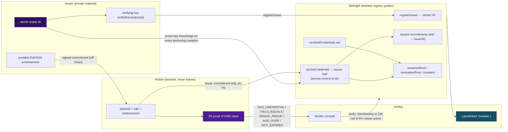

# VeriShield

Zero-knowledge credential verification on Midnight — prove a single claim, don't hand over the whole certificate.

[](https://github.com/pratikshakalbhor/verishield/actions/workflows/ci.yml)


## Table of contents

- [Live deployment](#live-deployment)
- [The problem](#the-problem)
- [Security model](#security-model)
- [Architecture](#architecture)
- [Features](#features)
- [Tech stack](#tech-stack)
- [Getting started](#getting-started)
- [Usage walkthrough](#usage-walkthrough)
- [Test case / verification table](#test-case--verification-table)
- [Project structure](#project-structure)
- [Design decisions](#design-decisions)
- [License](#license)

---

## Live deployment

A **real, finalized on-chain deployment exists on Midnight Preprod** — not a simulation, not a
local devnet. Every value below is pulled from the committed deploy manifest
[`managed/deploy/preprod.json`](managed/deploy/preprod.json), which was written by the deploy
tool after the node accepted and finalized the transaction.

| Field | Value |
|-------|-------|
| Network | `preprod` — Midnight public Preprod (`specVersion 1000300`) |
| Wallet address | `mn_addr_preprod1yccfqe5up5g847f3rg5qktev5hz8dvzghe58fn95qpgyekzh96dsk7psx0` (unshielded Preprod address used for the deployment; asserted by `MIDNIGHT_EXPECTED_WALLET_ADDRESS` — the seed itself is never stored in the repo) |
| Contract address | `f9966bb9b48e0eba85a59909b0a3619e904a48888f5c19b6ab9501efa958747f` |
| On-chain tx hash | `a4fda59021c5b5afe4cebe9eba352cb67e151f87b9df60d3906e56be806fd98c` |
| Local SDK tx id | `00a9dd89c700d7c505e56fd1331996f7f74d935cc97b0c04a69b88cd2e1de27cba` (the tool's local id for the submitted unproven tx; the on-chain hash above is the authoritative record) |
| Block | `2687934` / `993f43c6318d601bcaea90016d218633fe65975ed7860c6c182ef39d5befa62c` |
| Deployed | `2026-09-24 10:21:18 UTC` (`deployedAt 1790245278`) |
| Confirmed | `2026-09-24 10:43:26 UTC` (`confirmedAt 1790246606`) |
| Coin public key | `f29be517b9280677f1da33d6099ab5989910a8182c8534b26236ebed30b24227` |
| Contract artifacts | `packages/contracts/managed/credential-registry` — Compact `0.31.1` / language `0.23.0` / runtime `0.16.0` (ledger v8; committed manifest `compiler/contract-info.json`) |
| Deploy-record issuer | `University of Midnight` (id `98f78286d081f48a13249cf283aa7877a99de33ad4e250ba438ba40b7037f8f7`) |
| Deploy-record schema | `BachelorDegree:v1` (id `c2856010799c4d8f4d5b1f7f52fb0efff4cde263210bc57fa33478e09bf535f9`) |
| Registry state | `registrationOnChain: false` — the contract is live with an **empty ledger**; issuer/schema/credential provisioning has **not** been executed on-chain yet |
| Explorer | [Midnight network explorer](https://explorer.midnight.network/) — search the contract address (or the on-chain tx hash) there |

> **Do not re-run the deploy command against a live wallet.** The deploy entry point refuses to
> broadcast without an explicit opt-in — `MIDNIGHT_PREPROD_DEPLOY_CONFIRM=yes npm run deploy -- --network=preprod`
> (note the `--`: npm swallows flags otherwise and would silently target the local devnet). A
> re-run **deterministically re-derives a fresh contract address** from the same inputs and
> would broadcast again with real funds. The guard also hard-stops on any network whose
> `specVersion >= 2000000` — the boundary at which this branch's ledger-v8 artifact stops being
> deployable (after the Midnight v9 fork, switch back to the `main` branch's v9 contract). If
> you need to move the contract, rotate the deploy seed first and expect a new address.

**Two distinct addresses — never conflated:**

| Address | Value | Status |
|---------|-------|--------|
| **Preprod (this branch)** | `f9966bb9b48e0eba85a59909b0a3619e904a48888f5c19b6ab9501efa958747f` | **Real — finalized on-chain** on Preprod (confirmed above) |
| Local devnet (ledger v9, proven on `main`) | `b72da755eea42269a7d21853c42e2c3b630f78fec8d3712d93b4a4bb66e08499` (last value in `managed/deploy/local.json`) | Real — `main`'s v9 deploy path, proven on a local ledger-v9 devnet ([`doc/evidence/evidence-deploy.json`](doc/evidence/evidence-deploy.json)) |

## The problem

Employers, banks and universities demand the *whole certificate* to check **one fact** — a
degree, an age, a license status. That hands over name, marks, date of birth and license
numbers to parties who never needed them, and there is no cryptographic guarantee the document
shown wasn't altered. VeriShield inverts this: the issuer anchors a *commitment* to a
credential on Midnight, the holder computes a zero-knowledge proof of a **single claim**, and
the verifier receives exactly one field: `{ proofValid: boolean }`.

## Security model

**This branch is honest about its design.** It compiles against **ledger v8** (Compact `0.31.1`
/ language `0.23.0` / runtime `0.16.0`) — the version every public Midnight network runs today
(this deployment's `specVersion 1000300`). That toolchain predates the in-circuit
`jubjubSchnorrVerify` builtins (introduced in compiler `0.34.0` / runtime `0.19.0`, ledger v9),
so **issuer authenticity is anchored at the ledger level, not inside the ZK circuit**.

- **Ledger-level issuer authority.** `registerIssuer` stores `ecMulGenerator(sk)` — the issuer's
  verifying key derived from a private `Field` scalar — for a registered id
  ([`credential-registry.compact:200-211`](packages/contracts/src/credential-registry.compact#L200-L211)).
  Every registry mutation that binds data to the chain (`anchorCredential`, `revokeCredential`,
  the root updaters) calls `requireIssuerAuthority`
  ([`credential-registry.compact:161-167`](packages/contracts/src/credential-registry.compact#L161-L167)),
  which proves control of that scalar in-circuit against the stored verifying key.
- **Signature-blind claim circuits.** The holder's claim circuits do **not** verify a
  signature. `verifyCredential` ([`credential-registry.compact:177-191`](packages/contracts/src/credential-registry.compact#L177-L191))
  recomputes the commitment from the private payload and asserts: issuer registered + active,
  schema known and matching, the issuance leaf is **in the on-chain registry**, and the
  commitment is **not revoked**. Authority came from the anchoring transaction, not from a
  holder-side expectation that the proof itself re-checks the issuer's signature.
- **Portable Ed25519 holder signature (off-chain).** When a credential is issued, the issuer
  also Ed25519-signs the commitment with the ledger runtime's own `signData` primitive
  ([`credential.ts:169-170`](packages/shared/src/midnight/credential.ts#L169-L170)); holders and
  third parties can verify that endorsement with `verifyCredentialSignature` *without any
  network round-trip*.

**Read the consequences plainly.**

- `proofValid = true` proves the commitment was recomputed from the holder's private payload
  **and** that this exact commitment entered the anchored issuance registry — entry required
  the scalar-key holder's authorization at anchor time. That is a **chain-registry guarantee**,
  not an offline signature check.
- A **forged or tampered holder signature is invisible to the circuit**. It is only caught
  when an off-chain party independently calls `verifyCredentialSignature`. A verifier that
  checks only the proof will accept a signature-blind proof even if the accompanying
  endorsement bytes were tampered with — the harness states this explicitly.
- Verifying a proof assumes the **on-chain registry is honest and available**; the proof is not
  self-contained the way the in-circuit signature variant is.

**What `main` does instead (and why this branch exists).** The `main` branch's v9 contract puts
`jubjubSchnorrVerify` *inside* each claim circuit — each proof independently re-derives the
commitment and re-checks the signature against the registered key, so a forged or wrong-key
signature fails the proof itself. That variant is fully proven on a ledger-v9 local devnet but
**cannot be deployed to Preprod today**, because public networks still run ledger v8 (the deploy
guard stops at `specVersion >= 2000000`). This branch is the Preprod-deployable v8 variant with
ledger-anchoring; `main` remains the fuller-featured post-fork design.

The end-to-end harness is explicitly honest about this difference — see the
[Test case / verification table](#test-case--verification-table).

## Architecture



Everything under **Issuer** and **Holder** stays private — the chain never sees the payload, the
salt or the endorsement. The contract stores verifying keys, commitment leaves, revocation
membership and accumulator roots (all public), and a verifier observes exactly one value:
`proofValid`.

The claim circuits are deliberately small: `verifyCredential`
([`credential-registry.compact:177-191`](packages/contracts/src/credential-registry.compact#L177-L191))
checks issuer/schema/membership/revocation, and the five predicates (below) each add a single
bound on one field. On-chain provisioning against the **live Preprod contract** goes through the
browser: the Issuer portal builds the unproven call transaction, hands it to the connected 1AM
wallet for proof/balance/submission, and confirms it by polling the indexer for the new
`ContractCall` (`confirmCallOnChain` — see [Features](#features)).

## Features

### 1. Ledger-anchored issuer authenticity

- **What it does:** an issuer registers a verifying key `ecMulGenerator(sk)` derived from a
  private scalar ([`credential-registry.compact:200-211`](packages/contracts/src/credential-registry.compact#L200-L211));
  every mutation that binds a commitment to the chain proves control of that scalar
  (`requireIssuerAuthority`, [`credential-registry.compact:161-167`](packages/contracts/src/credential-registry.compact#L161-L167)).
- **Why it matters:** a commitment can only enter the issuance registry under the holder of the
  issuer key, and proofs are membership checks over that ledger-verified set. This is the
  Preprod-deployable v8 substitute for `main`'s in-circuit signature check.
- **Code:** on-chain circuits above; browser-side invocation plans in
  [`provision.ts:9-11`](packages/web/src/lib/midnight/provision.ts#L9-L11) (`registerIssuer` /
  `registerSchema` / `anchorCredential` argument shapes) and indexer-truthful confirmation in
  [`onchain.ts:360`](packages/web/src/lib/midnight/onchain.ts#L360).

### 2. Five claim predicates

- **What it does:** `HAS_CREDENTIAL`, `FIELD_EQUALS`, `RANGE_PROOF`, `AGE_OVER`, `NOT_EXPIRED` —
  each circuit returns a single public `Boolean`:
  [`proveHoldsCredential`](packages/contracts/src/credential-registry.compact#L272-L275),
  [`proveFieldEquals`](packages/contracts/src/credential-registry.compact#L278-L282),
  [`proveRange`](packages/contracts/src/credential-registry.compact#L285-L289),
  [`proveAgeOver`](packages/contracts/src/credential-registry.compact#L292-L297),
  [`proveNotExpired`](packages/contracts/src/credential-registry.compact#L300-L304).
- **Why it matters:** one credential, five provable facts; the holder picks the minimal claim a
  verifier actually needs (e.g. "my CGPA is at least 7.5" — not "show me the transcript").
- **Code:** claim→circuit map in [`proof.ts:29-33`](packages/shared/src/midnight/proof.ts#L29-L33);
  predicate assertions inside each circuit as cited above.

### 3. Holder privacy

- **What it does:** the private `CredentialPayload` (name hash, degree, DOB, CGPA, dates),
  the salt and the endorsement never leave the browser. `generateProof`
  ([`proof.ts:91-132`](packages/shared/src/midnight/proof.ts#L91-L132)) emits an artifact
  carrying a single boolean plus a binding digest, labeled `engine: "circuit-simulator"`.
- **Why it matters:** a verifier learns one fact and nothing else — the harness asserts the
  public output is exactly `{"proofValid":true}` (check 19 of 31).
- **Code:** payload struct at [`credential-registry.compact:62-71`](packages/contracts/src/credential-registry.compact#L62-L71);
  commitments are `persistentCommit` of payload+salt
  ([`credential-registry.compact:107-109`](packages/contracts/src/credential-registry.compact#L107-L109));
  web demo keeps private credentials in a module-scoped registry, never in React state
  ([`demo.ts:121`](packages/web/src/lib/midnight/demo.ts#L121)).

### 4. Revocation

- **What it does:** the issuer drops a commitment into the on-chain `revokedCredentials` set
  ([`revokeCredential`, credential-registry.compact:242-246](packages/contracts/src/credential-registry.compact#L242-L246));
  every later proof fails in-circuit with `Credential has been revoked`
  ([`credential-registry.compact:188`](packages/contracts/src/credential-registry.compact#L188)).
- **Why it matters:** revocation is enforced at proof time, globally, with no verifier-side
  revocation list to maintain — and the failed proof is surfaced honestly (`proofValid: false`).
- **Code:** in-circuit assert (`credential-registry.compact:188`), authorized mutation
  (`credential-registry.compact:242-246`), and an indexed `revocationRoot` audit anchor.

### 5. Four-function SDK

- **What it does:** `buildCredential / hashCredential / generateProof / verifyProof` as the
  four public functions of `@verishield/shared`
  ([`midnight/index.ts:178-181`](packages/shared/src/midnight/index.ts#L178-L181)) plus
  `createVeriShield()` with registration, issuance and revocation.
- **Why it matters:** one browser-safe surface for every consumer. The WASM-eager entry is
  isolated behind the `@verishield/shared/sdk` subpath and loaded lazily by
  [`web/src/lib/midnight/sdk.ts:18`](packages/web/src/lib/midnight/sdk.ts#L18), so the web shell
  stays runtime-free until the first proof.
- **Code:** subpath exports in `packages/shared/package.json`; the four-function surface at
  `midnight/index.ts:178-181`.

### 6. Three portals

- **What it does:** a shared proof store
  ([`proofStore.ts:43`](packages/web/src/stores/proofStore.ts#L43)) drives the Issuer, Holder
  and Verifier consoles, and the Issuer portal adds the on-chain panels
  ([`IssuerPortal.tsx:104-109`](packages/web/src/features/issuer/IssuerPortal.tsx#L104-L109) —
  `OnChainPanel` + `ProvisioningPanel`).
- **Why it matters:** the full issue → hold → prove → verify → revoke loop runs in one browser
  session, with real-wallet provisioning available against the live Preprod contract.
- **Code:** portals under [`packages/web/src/features/`](packages/web/src/features/); the shared
  store at `proofStore.ts:43`.

### 7. Wallet connect

- **What it does:** 1AM DApp-Connector discovery (CAIP-372) that enumerates injected wallet
  instances and reports connection status, shielded addresses, coin public key and DUST/NIGHT
  balances ([`wallet.ts:83`](packages/web/src/lib/midnight/wallet.ts#L83)); the web config talks
  to the real Preprod indexer, WebSocket feed and node
  ([`config.ts:43-45`](packages/web/src/lib/midnight/config.ts#L43-L45)).
- **Why it matters:** real Midnight wallet integration with correct protocol-level enumeration
  rather than a hard-coded extension key; the same wallet session gates on-chain provisioning.
- **Code:** [`wallet.ts:83-107`](packages/web/src/lib/midnight/wallet.ts#L83-L107).

### 8. Issuer API

- **What it does:** Express + SQLite service with JWT/RBAC, credential schemas, delivery
  codes/QR, audit log, and a hand-written OpenAPI document served at `/docs`
  ([`app.ts:27`](packages/issuer-api/src/app.ts#L27), document at
  [`openapi.ts:35`](packages/issuer-api/src/openapi.ts#L35)).
- **Why it matters:** a university can issue at scale (including CSV bulk import) while the
  signing/anchoring path stays behind the same cryptographic SDK.
- **Code:** `packages/issuer-api/src/app.ts` (Swagger mount at line 27).

## Tech stack

Versions pinned exactly as they appear in the repo's manifests and the committed compiler
manifest ([`packages/contracts/managed/credential-registry/compiler/contract-info.json`](packages/contracts/managed/credential-registry/compiler/contract-info.json)).

| Layer | Technology | Version (as pinned) |
|-------|-----------|---------------------|
| Contract & ZK | Compact compiler / language / runtime (compiler ledger line **8.0.2**; runtime override `@midnight-ntwrk/ledger-v8` **8.1.2**) | `0.31.1` / `0.23.0` / `0.16.0` (committed artifact manifest) |
| Contract & ZK | Issuer authenticity | **Ledger-level anchoring** (`ecMulGenerator` key + key-knowledge authority); portable Ed25519 holder signature via runtime `signData` / `verifySignature` |
| Contract & ZK | Deployed network | Preprod, `specVersion 1000300` (verified live in `src/deploy.ts`); local v8 devnet node `midnight-node:1.0.300` |
| Devnet (optional) | Node / indexer / proof server | `midnight-node:1.0.300` / `indexer-standalone:4.3.7` / `proof-server:8.1.0` (`docker-compose-v8.yml`) |
| Deploy toolchain | `@midnight-ntwrk/compact-js` / `compact-runtime` | `2.5.1` / `0.16.0` |
| Deploy toolchain | `midnight-js-contracts` / `testkit-js` | `4.1.1` (ledger-v8 line) |
| Frontend | React / React DOM | `^18.3.0` |
| Frontend | Vite (+ `vite-plugin-wasm` `^3.6.0`) | `^6.0.0` |
| Frontend | TypeScript | `^5.7.0` |
| Frontend | Tailwind CSS | `^3.4.0` |
| Frontend | Zustand / Framer Motion / React Router | `^5.0.0` / `^11.11.0` / `^6.28.0` |
| Crypto SDK | `@verishield/shared` | browser-safe entry + lazy WASM `sdk` subpath |
| Issuer service | Node / Express | `>=22` / `^4.21.0` |
| Issuer service | Drizzle ORM + `better-sqlite3` | `^0.36.0` / `^11.0.0` |
| Issuer service | Auth | JWT (`jsonwebtoken` `^9.0.2`) + RBAC, `express-rate-limit` `^7.4.0` |
| Tooling | npm (workspaces) | Node `22+` (npm required; no `packageManager` pin) |
| Tooling | Vitest / ESLint | `^3.2.0` / `^10` + `typescript-eslint` |
| CI | GitHub Actions | [`.github/workflows/ci.yml`](.github/workflows/ci.yml) — lint · typecheck · build · `test:e2e-crypto` |

## Getting started

Works on a clean machine with **no Midnight toolchain and no Docker** for the core path: the
compiled circuits are committed, and the harness drives them through
`@midnight-ntwrk/compact-runtime`'s simulator. Node.js **22+** and npm are required (repo uses
npm workspaces + `package-lock.json`).

```bash
# 1. Install dependencies
npm install

# 2. Run the web app (Issuer / Holder / Verifier portals)
npm run dev                        # → http://localhost:3000

# 3. Full credential lifecycle against the compiled circuits (no devnet/network needed)
npm run test:e2e-crypto            # expects 31/31 checks — see the verification table

# 4. Lint, typecheck, production build
npm run lint
npm run typecheck
npm run build
```

The web config defaults to the **real Preprod deployment** (`VITE_NETWORK` defaults to
`preprod`, and `VITE_CONTRACT_ADDRESS` defaults to
`f9966bb9b48e0eba85a59909b0a3619e904a48888f5c19b6ab9501efa958747f`) — see
[`config.ts`](packages/web/src/lib/midnight/config.ts). In-browser proofs run on the circuit
simulator; the Issuer portal's real on-chain provisioning (`registerIssuer / registerSchema /
anchorCredential`) requires a connected 1AM wallet and the live wallet's approval.

**Deployment (Preprod) — read the warning in [Live deployment](#live-deployment) first:**

```bash
MIDNIGHT_PREPROD_DEPLOY_CONFIRM=yes npm run deploy -- --network=preprod
```

Blocked without the opt-in; and do **not** re-run it against a wallet that already funded a live
contract — it deterministically derives a fresh address and would broadcast again with real
funds. The Preprod contract above is finalized on-chain and its ledger is empty
(`registrationOnChain: false`): provisioning is the intended next step from the Issuer portal.

Optional — current-era local Midnight **ledger-v8** devnet for this branch (matches Preprod's
v8 era; note `docker-compose.yml` is the ledger-9 stack used by `main`):

```bash
docker compose -f docker-compose-v8.yml up -d        # node 1.0.300 / indexer 4.3.7 / proof server 8.1.0
npm run deploy -- --network=local                    # writes managed/deploy/local.json (REAL local tx)
```

Optional — recompile the Compact contract (needs the Compact `0.31.1` toolchain,
preinstalled by `compact update 0.31.1`):

```bash
compact update 0.31.1
npm run compile:contracts
```

The previous public demo frontend was published at <https://proofkey-seven.vercel.app/>
(HTTP 200 verified 2026-09-22). This branch has not re-deployed it.

## Usage walkthrough

The complete flow, matching the ordered output of `npm run test:e2e-crypto`:

1. **Issuer registers** a ledger-level verifying key (`ecMulGenerator(sk)`) — stored on-chain;
   every anchoring mutation proves control of `sk`.
2. **Issuer anchors a credential** — the holder's payload is hashed with a random salt into a
   commitment (nothing else is revealed), the issuer Ed25519-signs the commitment, and the
   issuance leaf is bound to the registry under the issuer's key.
3. **Holder generates a proof** for *one* claim type (`HAS_CREDENTIAL`, `FIELD_EQUALS`,
   `RANGE_PROOF`, `AGE_OVER`, `NOT_EXPIRED`) against the private payload.
4. **Verifier sees ONLY `{ proofValid: true }`** — the harness asserts the public output is
   exactly `{"proofValid":true}` and that false, tampered or unanchored claims are rejected.
5. **Issuer revokes the credential** — the next proof attempt fails in-circuit:
   `failed assert: Credential has been revoked`.

```text
VeriShield — end-to-end credential lifecycle
engine: Midnight circuit simulator (real compiled circuits, ledger-anchoring)

1. Issuer onboarding (ledger-level verifying key)
2. Credential issuance (issuer signs + anchors commitment)
3. Positive proofs — every claim must verify
  ✓ HAS_CREDENTIAL proven & verified
  ✓ FIELD_EQUALS   proven & verified
  ✓ RANGE_PROOF    proven & verified
  ✓ AGE_OVER       proven & verified
  ✓ NOT_EXPIRED    proven & verified
4. Negative proofs — false claims must NOT verify
5. Ledger-anchoring enforcement (no in-circuit signature)
  ✓ tampered holder signature fails off-chain verification
  ✓ claim circuits are signature-blind by design
  ✓ unanchored credential rejected by claim circuits   failed assert: Credential was never issued by this issuer
  ✓ unauthorized issuer cannot anchor to a victim issuer
6. Revocation
  ✓ revoked credential can no longer be proven          failed assert: Credential has been revoked

31/31 checks passed — all good
```

In the browser (`npm run dev`): the **Issuer** portal issues and provisions, the **Holder**
portal generates a proof, the **Verifier** portal reveals `{ proofValid: true }` alongside a
redacted "Not transmitted" panel — and revocation disables further proofs on that credential.

## Test case / verification table

All results re-verified against the current repo state on **2026-09-24**.

| Suite | Scope | Result | Evidence |
|-------|-------|--------|----------|
| `npm run test:e2e-crypto` | Full lifecycle on the **compiled** circuits via the simulator | **31/31 checks** | named below; runner: [`packages/shared/scripts/e2e-crypto.ts`](packages/shared/scripts/e2e-crypto.ts) |
| `npm test` (Vitest) | `credential-registry` contract (register → issue → prove → verify → revoke, API surface) | **5/5 pass** | [`tests/credential-registry.test.ts`](tests/credential-registry.test.ts) |
| `npm run typecheck` | All six npm workspaces (web incl. provisioning feature) | **Green** | verified 2026-09-24 |
| `npm run lint` | Feature/store/component/contract code | **0 errors** | repo-wide run still reports **42 pre-existing errors confined to scratch debugging files** (`.wallet-dust-sync/*`, `dust-events-probe.mjs`) — not part of this branch's quality surface |
| `npm run build --workspace=web` | Production build (Vite, WASM prover keys) | **Succeeds** (~75 s) | prover keys: `registerIssuer` 683.8 kB, `registerSchema` 279.5 kB, `anchorCredential` 3.08 MB, claim circuits ≈5.2 MB; benign asset-size warning |
| Preprod deployment | Really finalized on-chain | **Confirmed** | contract `f9966bb9…747f`, block `2687934`, on-chain tx `a4fda590…`, 2026-09-24 — see [Live deployment](#live-deployment) |
| CI | GitHub Actions workflow | **Real** — lint · typecheck · build · `test:e2e-crypto` on push to `main` / PR / `workflow_dispatch` | [`.github/workflows/ci.yml`](.github/workflows/ci.yml) |
| `LICENSE` | Canonical Apache-2.0 text | **Byte-for-byte match** | 202-line canonical text + appended copyright line; see [License](#license) |

**The 31 `test:e2e-crypto` checks, by section** (issuer identity in this harness is
`University of Midnight`, matching the deploy record):

1. **Issuer onboarding (5):** issuer registered; verifying key is a curve point; ledger
   `issuerCount = 1`; on-chain verifying key matches off-chain derivation; schema registered.
2. **Credential issuance (8):** commitment is 32 bytes; credential anchored on-chain; issuer
   Ed25519 signature verifies (`verifyCredentialSignature`); signature is a 64-byte Ed25519
   signature; `hashCredential` matches `buildCredential`; degree field round-trips; credential
   id is PII-free (`cred_`); standalone `buildCredential` is deterministic.
3. **Positive proofs (6):** `HAS_CREDENTIAL`, `FIELD_EQUALS`, `RANGE_PROOF`, `AGE_OVER`,
   `NOT_EXPIRED` all proven & verified; verifier sees **only** `{"proofValid":true}`.
4. **Negative proofs (5):** `AGE_OVER 30` rejected (holder is 25); `RANGE_PROOF 9.5` rejected
   (holder has 8.21); `FIELD_EQUALS PhD Physics` rejected; `NOT_EXPIRED` after expiry rejected;
   tampered binding digest rejected.
5. **Ledger-anchoring enforcement (5):** tampered holder signature fails **off-chain**
   verification; claim circuits are signature-blind by design (the tampered proof still
   verifies — the design's stated behavior); a new random salt yields a different commitment;
   unanchored credential rejected by claim circuits; an unauthorized issuer cannot anchor to a
   victim issuer.
6. **Revocation (2):** `revokedCredentials` contains the commitment; the revoked credential can
   no longer be proven.

## Project structure

```
verishield/
├── packages/
│   ├── contracts/        # Compact source + compiled credential-registry bindings (Compact 0.31.1 / ledger v8)
│   │   └── managed/      #   committed artifacts: compiler manifest, contract bindings, .zkir circuits, proving keys
│   ├── shared/           # Domain types, encoders and the cryptographic SDK (@verishield/shared + sdk subpath)
│   │   └── scripts/
│   │       └── e2e-crypto.ts        # 31/31 lifecycle harness
│   ├── web/              # Vite + React three-portal frontend (Issuer / Holder / Verifier)
│   │   └── src/
│   │       ├── lib/midnight/        # demo identity, provisioning plans, on-chain calls, wallet, config
│   │       ├── stores/              # proofStore + provisioningStore (steps, anchor selection, resume)
│   │       └── components/onchain/  # OnChainPanel + ProvisioningPanel (real-wallet provisioning UI)
│   ├── issuer-api/       # Express + SQLite issuing service (JWT/RBAC, schemas, delivery, audit, OpenAPI)
│   └── deploy-tools/     # Node-only real-deploy toolchain (proof cache, ledger-v8 handling)
├── doc/evidence/         # Deploy reproducibility evidence (deploy JSON, node + indexer logs)
├── managed/deploy/       # Latest deploy manifest written by `npm run deploy` (preprod.json, local.json)
├── src/                  # Root-level CLI + deploy + network-selection tooling (`npm run cli`, `npm run deploy`)
├── tests/                # Vitest suite for the credential-registry contract
├── docker-compose-v8.yml # Optional ledger-v8 devnet (node 1.0.300 / indexer 4.3.7 / proof server 8.1.0)
└── .github/workflows/    # CI: lint · typecheck · build · e2e-crypto
```

## Design decisions

1. **Ledger-anchoring instead of in-circuit signatures — because Preprod runs ledger v8.**
   Every public Midnight network today runs `specVersion 1000000`-era ledgers, so a
   Preprod-deployable contract must compile with the `0.31.x` toolchain — the era **before**
   `jubjubSchnorrVerify` existed. Waiting for the v9 fork would mean no live deployment at all.
   This branch accepts the trade-off (authority at anchoring time, signature-blind claim
   circuits, a portable off-chain Ed25519 endorsement) in exchange for a real, finalized
   Preprod contract today; the `main` branch keeps the self-contained in-circuit variant for
   the post-fork network. The deploy guard hard-stops at `specVersion >= 2000000` so nobody
   accidentally deploys the v8 artifact after the fork.

2. **One Field-reduction bug fixed where it caused the worst failure mode.** The compact-runtime
   `bigIntModFr` helper only *validates* Field inputs — it rejects values at or above the
   ~252-bit modulus and never *reduces* them ([`encoding.ts:20-26`](packages/shared/src/midnight/encoding.ts#L20-L26)).
   An issuer secret drawn as raw 32 random bytes (uniform up to `2^256`) therefore cannot be
   passed straight to a `Field` witness. `signingKeyFromSecret` now explicitly reduces with
   `bytesToBigIntBE(secret) % FIELD_MODULUS`
   ([`encoding.ts:91-97`](packages/shared/src/midnight/encoding.ts#L91-L97)), so the
   derived key is always a valid scalar — the fix is exercised by the 31-check harness and the
   deriving-key assertions in `registerIssuer`.

3. **Only indexer-confirmed hashes are ever reported.** The on-chain provisioning flow
   snapshots the ledger before submission, then polls the indexer for a *new* `ContractCall`
   with the matching `entryPoint` — it never fabricates a "theoretical" transaction id and
   throws honestly if the submitted action diverges or the 90 s window lapses
   ([`onchain.ts:338`](packages/web/src/lib/midnight/onchain.ts#L338), [`onchain.ts:360`](packages/web/src/lib/midnight/onchain.ts#L360)).
   Every UI "confirmed" hash in the provisioning panel is an indexer-verified fact. Relatedly,
   witness material (the issuer signing scalar) is held in module scope
   ([`provision.ts:19`](packages/web/src/lib/midnight/provision.ts#L19)) and never placed in
   React state, logs or the zustand store.

4. **The browser demo is a circuit-simulator engine; the deployment is real.** In-browser
   proofs run the real compiled circuits through `compact-runtime`'s simulator and are labeled
   `engine: "circuit-simulator"`, `zkProven: false` — the UI prints this amber warning itself.
   The Preprod deployment and the wallet-driven provisioning path are real and on-chain; the
   two are never conflated in the UI or this README.

## License

Apache-2.0 — see the [`LICENSE`](LICENSE) file (© 2026 Pratiksha Kalbhor). The text is the
canonical Apache-2.0 license verified byte-for-byte against
https://www.apache.org/licenses/LICENSE-2.0.txt (202-line canonical body plus the appended
copyright line); all six project manifests (`package.json` at root and in `packages/{contracts,
shared, web, issuer-api, deploy-tools}`) carry `"license": "Apache-2.0"`.